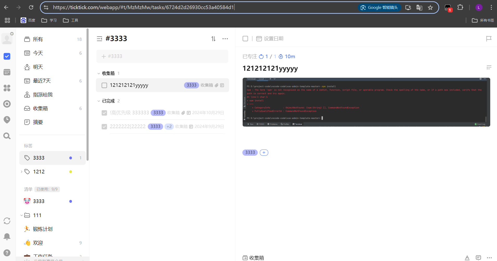
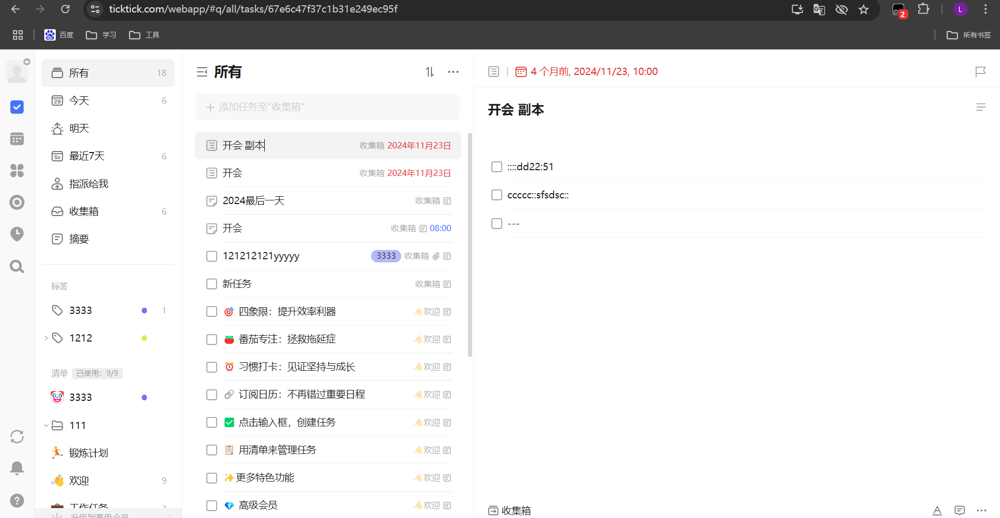

# 周报

# 上周目标完成度
- 完善登录页面 注册页面 和后端逻辑-- 没有完成
- 完成任务页面和任务列表、任务详情、任务分类组件 ---完成任务页面布局和任务详情组件
- 完成hobit习惯页面和计时组件、和习惯功能打卡组件----未完成

## 进度
- 做了slate的专项笔记
- 为了面试了解了react的生命周期
- 完善了myicon组件  增加了一个鼠标悬浮后的提示
- 初步写了EditorBar按钮组件 一个文本编辑器的雏形组件RenderElement RenderLeaf
- 学习了 redux(redux toolkit) 相比redux的传统方法  有点陌生
- 配置axios

## 收获
- 学习了slate的基本知识点 体验了slate是一个高度开放的编辑框架  自定义节点类型  自定义节点渲染 
- 稍微深入的了解了js中的闭包和react函数组件之间的关系  slate利用js对闭包的环境标记，在闭包内定义的函数只要还有调用就不会回收词法环境的特性，去维持、引用、修改内存的中fiber节点
- slate 函数组件取消this的方式是通过闭包的特性引用的状态，不需new新的实列 
- 维持刷新后状态不变的原因是：在fiber内部维持的是双虚拟dom节点树（current（当前）和 workInProgress（新）两棵树），

## 问题
- 目前的项目运行后：src\app\task\all\page.tsx这个页面会出现第三个包含任务详情的滑动框首先打开 而且布局会占比很大闪现之后才恢复成三个可滑动框和对应的样式
- 场景：  appRouter下页面布局不变  但是路由改变 这样怎么实现？如果使用link标签应该是会触发重新加载页面的 但是我的task[]应该是一次性加载的，并且做好分类标记的吧，之前我是用的后端计算就等于是重新加载页面一样的方式，

## 总结
 - 项目进度有点慢了 
 - 对react和redux  slate生疏了上手不熟练
 - ts泛型不熟悉 对类型了解不够  看代码困扰多
# 下周目标
- 继续完成登录逻辑 和注册逻辑
- 完成任务页面 
- 尽量完成任务的标签、清单分类

